<!doctype html>
<html lang="es">
<head>
  <meta charset="utf-8" />
  <meta name="viewport" content="width=device-width, initial-scale=1" />
  <title>Resident Evil 2 — Revista Fan (Nintendo 64)</title>
  <meta name="description" content="Revista fan centrada en Resident Evil 2 para Nintendo 64: portada, personajes con imagen y descripción al clic, armas con imagen, enemigos/objetos/trucos y datos sin imágenes innecesarias, gameplay, momento tenso y referencias." />
  <link rel="icon" href="/favicon.ico" />
  <link rel="preconnect" href="https://fonts.googleapis.com">
  <link rel="preconnect" href="https://fonts.gstatic.com" crossorigin>
  <link href="https://fonts.googleapis.com/css2?family=Bebas+Neue&family=Inter:wght@400;700&display=swap" rel="stylesheet">

  
</head>
<body>
  
  <header>
    

      
<h1>Resident Evil 2 · N64</h1>

      <nav aria-label="Principal">
        <ul>
          <li><a href="#intro">Inicio</a></li>
          <li><a href="#dossier">Contexto</a></li>
          <li><a href="#personajes">Personajes</a></li>
          <li><a href="#armas">Armas</a></li>
          <li><a href="#enemigos">Enemigos</a></li>
          <li><a href="#objetos">Objetos</a></li>
          <li><a href="#datos">Datos</a></li>
          <li><a href="#momento">Mi momento tenso</a></li> <!-- cambiado -->
          <li><a href="#gameplay">Gameplay</a></li>
          <li><a href="#curiosidades">Curiosidades</a></li>
          <li><a href="#referencias">Referencias</a></li>
        </ul>
      </nav>
    

  </header>

 
  <section class="hero reveal" id="hero">
    

      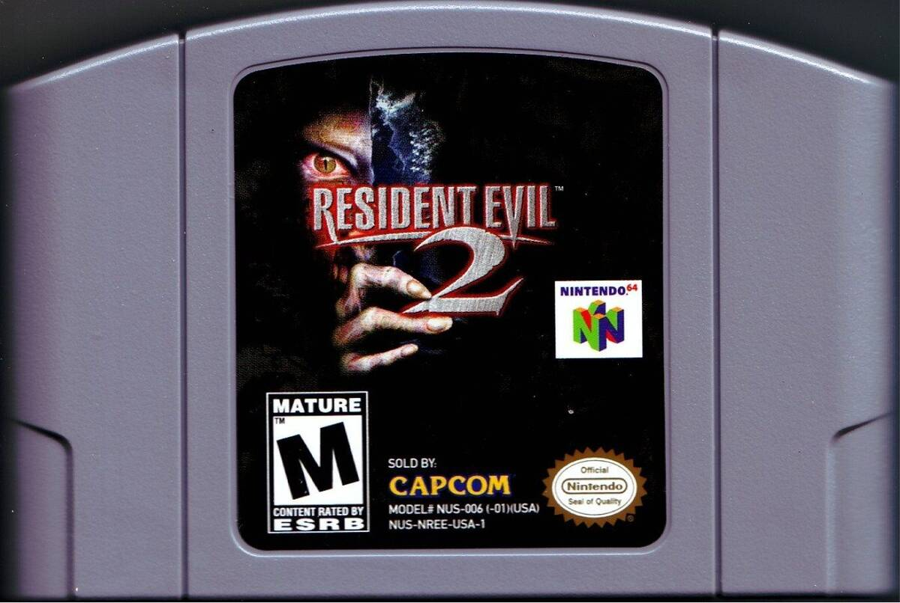
      

      

        

          <h2>Bienvenido a Raccoon City</h2>
          

            Nintendo 64 (1999)
            Terror
            Tips y Cositas
          

        

      

    

  </section>

  <main>
    
    <section id="intro" class="wrap reveal">
      <h3 class="section">Un par de datitos</h3>
      

        
<strong>Esta página se centra en la versión de Nintendo 64</strong> de <em>Resident Evil 2</em>. Este port comprimió dos discos de PS1 en un cartucho de 64&nbsp;MB.

        <ul style="margin:8px 0 0; padding-left:18px" class="muted">
          <li><strong>Núcleo:</strong> cámaras fijas, inventario limitado y rutas A/B.</li>
          <li><strong>Ritmo:</strong> explora, resuelve puzles y escapa (¡hola, Mr. X!).</li>
        </ul>
      

    </section>

    <section id="dossier" class="wrap reveal">
      <h3 class="section"> Contexto - La noche del desastre</h3>
      

        <article class="card">
          
Claire busca a su hermano Chris. Leon llega a su primer día en el R.P.D. Ambos quedan atrapados en Raccoon City por el <strong>T-Virus</strong>. La historia se vive en paralelo y afecta qué objetos y escenas encontrarás.

          
<strong>Trama en una línea:</strong> escapar, exponer a Umbrella y sobrevivir a bioarmas como el Tyrant y las mutaciones G.

        </article>
        <aside>
          

            
<strong>Ficha rápida (N64):</strong> Port por Angel Studios (con Capcom Studio 3 y Factor 5).

            <ul class="muted" style="margin:8px 0 0; padding-left:18px">
              <li><strong>Diseño:</strong> cámaras fijas + fondos prerrenderizados.</li>
              <li><strong>Progreso:</strong> llaves de naipes, medallones y puzles.</li>
            </ul>
          

        </aside>
      

    </section>

    
    <section id="personajes" class="wrap reveal">
      <h3 class="section">Personajes</h3>
      <ul class="char-grid" style="padding:0; list-style:none">
        <!-- (mismas tarjetas que tenías) -->
        <li class="char">
          

            

              
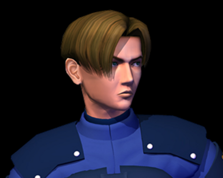

              <h4>Leon S. Kennedy</h4>
              
Novato del R.P.D. · Primer día

              
            

            

              
¡Pro tip! Templado en el caos. Sus rutas priorizan armas de fuego y momentos con el Tyrant.

              
<strong>Consejo:</strong> apunta a las piernas para ralentizar. Guarda granadas flash.

            

          

        </li>

        <li class="char">
          

            

              

              <h4>Claire Redfield</h4>
              
Estudiante y motociclista

              
            

            

              
¡Valiente total! Accede al lanzagranadas y protagoniza secciones con Sherry.

              
<strong>Consejo:</strong> alterna munición incendiaria/ácida según el enemigo.

            

          

        </li>

        <li class="char">
          

            

              
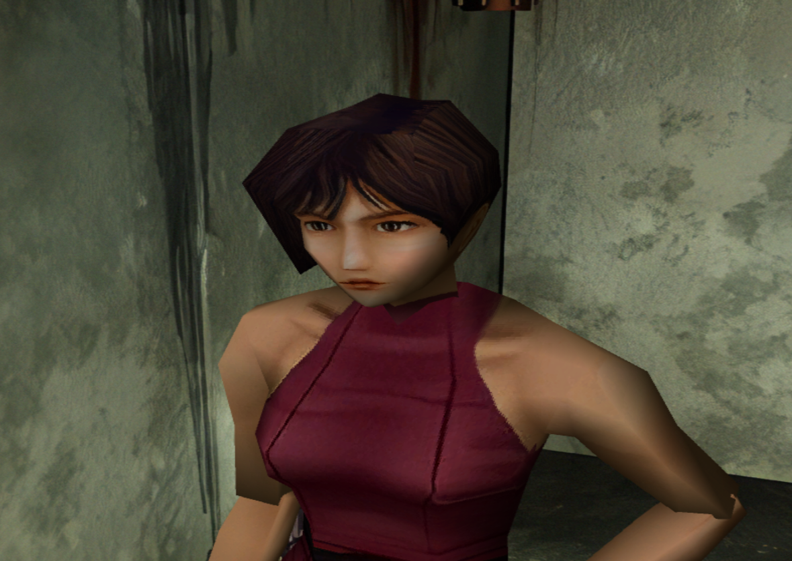

              <h4>Ada Wong</h4>
              
Aliada misteriosa

              
            

            

              
¡Giro tras giro! Sus acciones impactan la ruta de Leon.

              
<strong>Pista:</strong> explora a fondo: siempre hay señales.

            

          

        </li>

        <li class="char">
          

            

              

              <h4>“Mr. X” (T-103)</h4>
              
Bioarma de Umbrella

              
            

            

              
¡Se siente en los pasos! Perseguidor implacable: condiciona rutas y ritmo.

              
<strong>Consejo:</strong> evita duelos largos; usa puertas y atajos.

            

          

        </li>

        
        <li class="char">
          

            

              

              <h4>Sherry Birkin</h4>
              
Niña atrapada en el brote

              
            

            

Momentos de sigilo y rescate junto a Claire. ¡Tensión pura!

          

        </li>

        <li class="char">
          

            

              
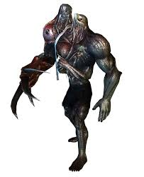

              <h4>William Birkin</h4>
              
Científico · Mutación G

              
            

            

Responsable del Proyecto G. Su transformación muestra el precio del experimento.

          

        </li>

        <li class="char">
          

            

              
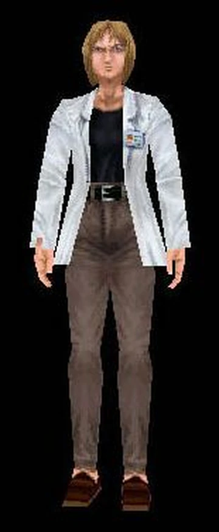

              <h4>Annette Birkin</h4>
              
Investigadora · Madre de Sherry

              
            

            

Entre la culpa y el deber. Conoce secretos clave del laboratorio y el virus G.

          

        </li>

        <li class="char">
          

            

              
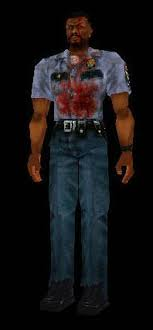

              <h4>Marvin Branagh</h4>
              
Oficial del R.P.D.

              
            

            

Apoyo temprano en la comisaría. ¡Un héroe silencioso!

          

        </li>

        <li class="char">
          

            

              

              <h4>Brian Irons</h4>
              
Jefe de policía

              
            

            

Oscuro y corrupto. Añade crudeza al colapso de la ciudad.

          

        </li>

        <li class="char">
          

            

              
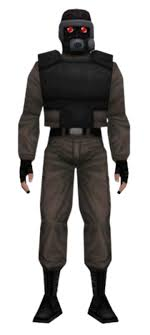

              <h4>HUNK</h4>
              
Operativo de seguridad

              
            

            

“El cuarto superviviente”. Desafío intenso de principio a fin.

          

        </li>

        <li class="char">
          

            

              
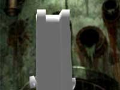

              <h4>Tofu</h4>
              
Modo extra (broma)

              
            

            

¡Memorable! Pone a prueba tu dominio del mapa bajo condiciones únicas.

          

        </li>
      </ul>
    </section>

    
    <section id="armas" class="wrap reveal">
      <h3 class="section">Armas</h3>
      

        <article class="info-card">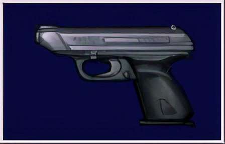
<h4 class="i-title">Pistolas 9mm</h4>
Base de ambos protagonistas. Precisas y con munición común. Ideales para controlar zombis.

N64: misma lógica

</article>
        <article class="info-card">
<h4 class="i-title">Escopeta</h4>
Daño alto a corta distancia. Perfecta contra grupos o lickers a quemarropa.

Apunta hacia arriba

</article>
        <article class="info-card">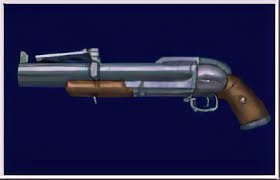
<h4 class="i-title">Lanzagranadas (Claire)</h4>
Munición ácida/incendiaria para adaptarte al enemigo. Muy útil en el laboratorio.

Selección de munición

</article>
        <article class="info-card">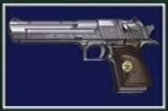
<h4 class="i-title">Magnum</h4>
Golpea durísimo, pero es escasa. Guárdala para jefes o emergencias.

Jefes

</article>
        <article class="info-card">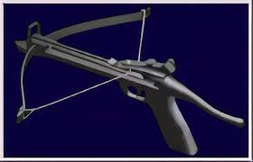
<h4 class="i-title">Ballesta (Claire)</h4>
Dispara tres saetas. Buen control en pasillos cortos.

Tri-salva

</article>
        <article class="info-card">
<h4 class="i-title">Lanzallamas</h4>
Armas situacionales muy efectivas contra tipos específicos de criatura.

Contra plantas

</article>
      

    </section>

    
    <section id="enemigos" class="wrap reveal">
      <h3 class="section">Enemigos & Criaturas</h3>
      

        <article class="info-card">
<h4 class="i-title">Zombi clásico</h4>
Lentos pero numerosos. Controla con disparos a cabeza o piernas.

Consejo: piernas

</article>
        <article class="info-card">
<h4 class="i-title">Licker</h4>
No ve, pero oye. Camina para no hacer ruido y remata de cerca.

Sigilo

</article>
        <article class="info-card">
<h4 class="i-title">Perros (Cerberus)</h4>
Rápidos y en grupo. La escopeta limpia bien.

Corta distancia

</article>
        <article class="info-card">
<h4 class="i-title">Cuervos</h4>
Molestos. Si puedes, ignóralos para ahorrar munición.

Ahorro

</article>
        <article class="info-card">
<h4 class="i-title">Arañas</h4>
Veneno y alcance. Evítalas o usa armas de área.

Área

</article>
        <article class="info-card">
<h4 class="i-title">Plantas (Ivy)</h4>
Vulnerables al fuego y ácido. No las dejes acercarse.

Fuego/Ácido

</article>
        <article class="info-card">
<h4 class="i-title">G-engendros</h4>
Pequeños pero peligrosos en grupo. Avanza con cuidado.

Emboscadas

</article>
        <article class="info-card">
<h4 class="i-title">Cocodrilo gigante</h4>
Encuentro específico: observa el entorno y actúa rápido.

Evento

</article>
        <article class="info-card">
<h4 class="i-title">Tyrant T-103 (Mr. X)</h4>
Te acosa en la comisaría. Usa atajos y puertas para perderlo.

No malgastes balas

</article>
        <article class="info-card">
<h4 class="i-title">Mutaciones de Birkin</h4>
Jefes por fases. Aprende patrones y guarda munición pesada.

Fases

</article>
      

    </section>

    
    <section id="objetos" class="wrap reveal">
      <h3 class="section">Objetos & Curación</h3>
      

        <article class="info-card">
<h4 class="i-title">Hierba verde</h4>
Cura básica. Combina para mejores efectos.

Base

</article>
        <article class="info-card">
<h4 class="i-title">Hierba roja</h4>
No cura sola; potencia la mezcla con verde.

Potenciador

</article>
        <article class="info-card">
<h4 class="i-title">Hierba azul</h4>
Antídoto contra veneno. Úsala en mezcla.

Antídoto

</article>
        <article class="info-card">
<h4 class="i-title">Spray de primeros auxilios</h4>
Cura completa de emergencia. Úsalo con cabeza.

Cura total

</article>
        <article class="info-card">
<h4 class="i-title">Cintas de tinta</h4>
Guardado clásico en máquinas de escribir. Adminístralas.

Guardar

</article>
        <article class="info-card">
<h4 class="i-title">Llaves de naipes</h4>
Diamante, pica, trébol y corazón abren alas de la comisaría.

Progreso

</article>
        <article class="info-card">
<h4 class="i-title">Medallones/enchufes</h4>
Ítems de puzle que desbloquean nuevas áreas.

Puzles

</article>
        <article class="info-card">
<h4 class="i-title">Encendedor / Llave especial</h4>
Herramientas clave para acciones puntuales.

Contextual

</article>
      

      

        

          ¡Mezclas top!
          Verde + Roja = cura total
          Verde + Azul = cura + antídoto
        

      

    </section>

    
    <section id="datos" class="wrap reveal">
      <h3 class="section">Datos interesantes</h3>
      

        <article class="info-card">
<h4 class="i-title">Prototipo “1.5”</h4>
La versión inicial se reinició y dio lugar al RE2 final.

Reinicio

</article>
        <article class="info-card">
<h4 class="i-title">Puertas = carga</h4>
Las animaciones de puertas hacían de pantalla de carga creativa.

Truco técnico

</article>
        <article class="info-card">
<h4 class="i-title">Comisaría-museo</h4>
Explica la estética de salas, vitrales y símbolos.

Ambientación

</article>
      

    </section>

    
    <section id="momento" class="wrap reveal">
      <h3 class="section">Mi primer momento tenso en el juego</h3>
      

      
        <figure class="shot">
          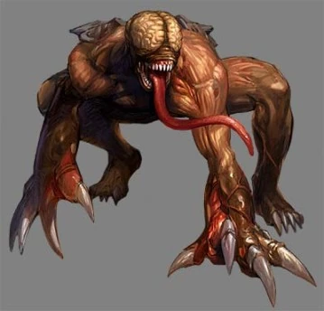
        </figure>
        <article class="story">
          
<strong>¡Me llevé un gran susto!</strong> Porque venía tranquilo por el pasillo cuando escuché el <em>ras-ras</em> en el techo. Miré arriba y… <strong>¡Un Feo Licker!</strong>

          
Me congelé por  un segundo. Aprendí que caminar despacio ayuda (no ven, pero sí oyen). Dos pasos atrás, escopeta lista… y de milagro salí vivo.

          
Si lo ves a distancia, avanza lento y remata a quemarropa. Ahorras balas y nervios.

        </article>
      

    </section>

    
    <section id="gameplay" class="wrap reveal">
      <h3 class="section">Gameplay (Nintendo 64)</h3>
      

        
Gameplay completo de Resident Evil 2 (Y si, es el juego completo).

      

      

        <iframe src="https://www.youtube.com/embed/cOEB3TGQAIc" title="Resident Evil 2 (N64) - Gameplay" allow="accelerometer; autoplay; clipboard-write; encrypted-media; gyroscope; picture-in-picture; web-share" allowfullscreen loading="lazy"></iframe>
      

      
Enlace directo: <a href="https://www.youtube.com/watch?v=cOEB3TGQAIc" target="_blank" rel="noopener">YouTube — Longplay RE2 N64</a>

    </section>

    
    <section id="curiosidades" class="wrap reveal">
      <h3 class="section">Curiosidades</h3>
      

        

¿Qué es el Sistema A/B?

Completar con un personaje abre la ruta del otro con cambios de objetos, jefes y escenas.

        

Consejo rápido

Deja siempre un espacio libre en el inventario para llaves o ítems clave.

      

    </section>

    
    <section id="referencias" class="wrap reveal">
      <h3 class="section">Referencias</h3>
      

        <ul style="margin:0; padding-left:18px">
          <li>Wikipedia — <a href="https://en.wikipedia.org/wiki/Resident_Evil_2#Nintendo_64" target="_blank" rel="noopener">Resident Evil 2 · Nintendo 64</a></li>
          <li>GameSpot (1999) — <a href="https://www.gamespot.com/reviews/resident-evil-2-review/1900-2543705/" target="_blank" rel="noopener">Reseña N64</a></li>
          <li>GamesRadar — <a href="https://www.gamesradar.com/games/survival-horror/how-resident-evil-2-came-to-nintendo-64-despite-capcoms-doubts-i-recall-having-daily-meetings-and-someone-asked-should-we-be-worried/" target="_blank" rel="noopener">Historia del port</a></li>
          <li>TCRF — <a href="https://tcrf.net/Resident_Evil_2_(Nintendo_64)" target="_blank" rel="noopener">Detalles técnicos de N64</a></li>
          <li>Gameplay — <a href="https://www.youtube.com/watch?v=cOEB3TGQAIc" target="_blank" rel="noopener">Longplay RE2 (N64)</a></li>
        </ul>
      

    </section>
  </main>

  <footer>
    

      <small>©  · Sitio creado por <strong>Jeremias Carrasco</strong> · Proyecto académico de fans — Marcas pertenecen a sus dueños (Capcom, etc.).</small>
    

  </footer>

  
</body>
</html>
